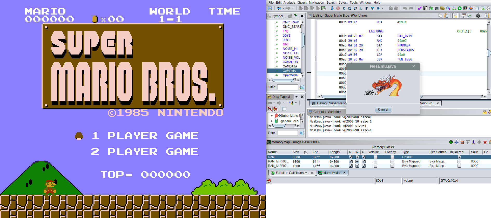
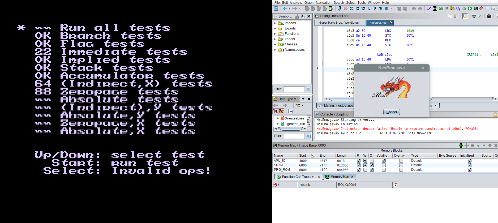
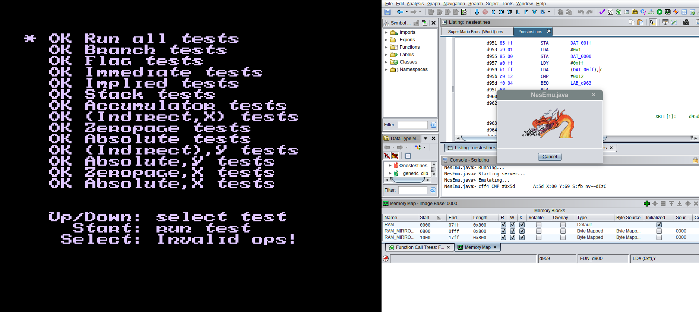
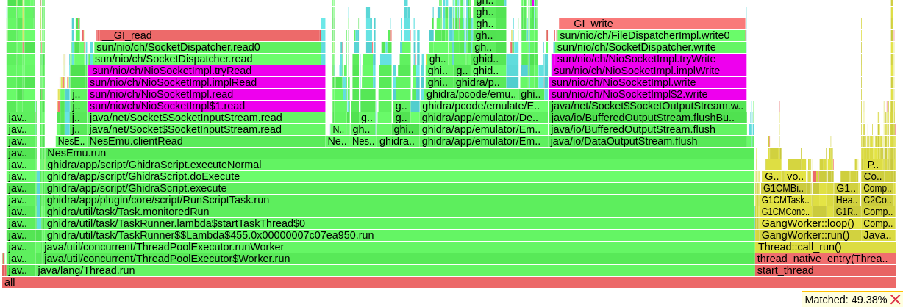

# Can Ghidra play Super Mario Bros?

The answer is: ~~very slowly~~ **YES**!

I've recorded keyboard inputs that can be replayed to complete the first level. It finishes at in-game time 316, but wall-clock time is **32 minutes**. Transitions and starting the second level adds another **15 minutes**. 😀

Demo (speedup 50x):

https://github.com/nevesnunes/ghidra-plays-mario/assets/9061071/9b571a39-9672-4dc5-ada2-4a149f60a0dd

## What?

I took an [existing minimal emulator](https://github.com/binji/smolnes), removed all CPU logic, and replaced it with a socket-based protocol for delegating CPU execution to Ghidra's PCode emulator (server). Everything else is still handled by the modified emulator (client), such as keyboard input and PPU logic.

## Why?

Processor module validation! Sure, Ghidra has [pcodetest](https://github.com/NationalSecurityAgency/ghidra/blob/master/Ghidra/Extensions/SleighDevTools/pcodetest/) for this purpose, but it's hard to tell how much coverage it provides. Apparently, not enough!

Just getting the Super Mario Bros title screen to render required fixing bugs in 3 instructions. [Even more were fixed](https://github.com/nevesnunes/ghidra/commit/63b08533033f527058a347e5133f9e6184ebad65) while appeasing [nestest.nes](https://github.com/christopherpow/nes-test-roms/blob/master/other/nestest.txt).

Before (some tests fail, until a crash after jumping to an invalid instruction):

After (all tests pass):

## Setup

Tested with Ghidra 10.3.2, on Debian GNU/Linux 12.

To reproduce the first level run:

1. Install [GhidraNes](https://github.com/kylewlacy/GhidraNes) (tested with commit `ef27b8d`);
2. Load a Super Mario Bros (World) ROM (sha1 `ea343f4e445a9050d4b4fbac2c77d0693b1d0922`), and make sure it's focused in the listing (a.k.a. disassembly) window (in case you have other files open);
3. Copy `./ghidra_scripts/NesEmu.java` to your project's `ghidra_scripts` directory;
4. Copy `./inputs/smb.w11full.inputs` to `/tmp/smb.inputs`;
5. On Ghidra's Window > Script Manager, run `NesEmu.java` (starts the server);
6. Run `make && ./smolnes_emuclt $ROM`, (starts the client, `$ROM` is the full path to the same ROM being disassembled in Ghidra);
7. Sit back and enjoy an ~1 FPS demo;

Of course, you can remove `/tmp/smb.inputs` and play yourself.

## Takeaways

* As seen in the demo, Ghidra is constantly re-analyzing functions, caused by [frantic clearing and disassembling of instructions](https://github.com/nevesnunes/ghidra-plays-mario/blob/fce8d25afb0a2a37870ddbafffea9880e74f81df/ghidra_scripts/NesEmu.java#L557). Not much room to improve here, since only disassembled instructions can be executed.
* I've run into some desync when recording inputs in the standalone emulator vs replaying them in Ghidra's emulator. This means that inputs likely end up being set at different instruction lines. Expect diffs in e.g. how many VBlank interrupts happen when comparing both CPU emulators' trace logs... Still, it wasn't bad enough to break the demo, please let me know if that's not the case for you.
* Currently, the protocol is very hardcoded for NES implementation details, and would benefit from a proper [TLV encoding](https://en.wikipedia.org/wiki/Type%E2%80%93length%E2%80%93value) to handle variable address / data sizes.

## Profiling

Some flamegraphs were captured with async-profiler: `./asprof -e itimer -d 30 -o flamegraph -f /tmp/out.html $GHIDRA_PID`

Surprisingly, stepping through instructions only takes about 15% of CPU time. About 50% is socket I/O (even after some quick optimizations like reusing the same buffer for payloads and buffering socket writes):

## Acknowledgements

* `deobfuscated.c` from [smolnes](https://github.com/binji/smolnes) is under [LICENSE.smolnes](./LICENSE.smolnes), and was modified into files `smolnes_emuclt.c` and `smolnes_standalone.c`;
* Remaining files are under [LICENSE](./LICENSE);
